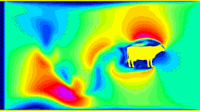

# Lattice-Boltzmann WebGL

  

> #### Clarification on AI use in this project :
> Having some experience of working with LLM in computational science for the past few years, it has become increasingly obvious that they are not to be trusted in physics related domains. In contrast, it's ability to quickly add JS and HTML elements has been found to be quite reliable. As such, AI has been used through Copilot to help in debugging and commenting as well as add HTML and JS features. It has **not** been used to implement the physics simulation.

This is my own little implementation of a Lattice-Boltzmann simulation in WebGL

## FAQ

> #### why?
> Because it looks cool, and it makes cool graphs, that's why.

> #### Can I try it?
> Yes, I should have setup a Github Pages for it. Check the about section of the repo

> #### Is there videos of it?
> Yes, there is a [Youtube Playlist](https://www.youtube.com/playlist?list=PLbVMHgx1jRJ25z9HuNSBwIXIyp2sq--8g) Where I'll occasionally put the cool stuff.

Just messing around with Lattice Boltzman simulation

WebGL cuz I wanna play with it online

### Ressources used

- [MRT Lattice Boltzmann Schemes for High Reynolds Number Flow in Two-Dimensional Lid-Driven Semi-Circular Cavity](https://www.researchgate.net/publication/270955554_MRT_Lattice_Boltzmann_Schemes_for_High_Reynolds_Number_Flow_in_Two-Dimensional_Lid-Driven_Semi-Circular_Cavity)

- Gábor Závodszky's [medFlow2 Lattice-Boltzmann code](https://github.com/gzavo/medFlow2D/blob/master/src/lbm/lb.c)
